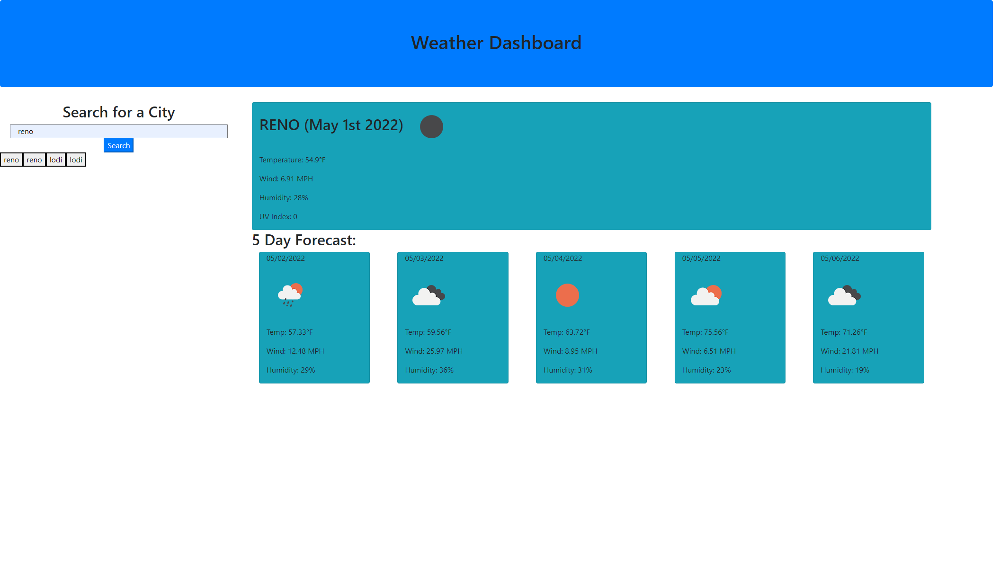

# weather-dashboard

## **Description**

1. First I created an HTML with a basic structure for the page.

2. I next started a js document in which I compiled a majority of the code.

    1. I created variables for all of my hardcoded elements which were divs for current weather and a 5-day-forcast.

    2.I then used moment.js to add a date to the top of each of the divs and increased current date by one for each of the 5 days in the forecast.

    3. Next I created an event listener to respons when the search button was clicked.

    4. I used the geo API on Open Weather to get the latitude and longitude for the city name that was searched. This was then used in the onecall API to get the data for said city.

    5. I filled the corresponding divs with the weather data that was requested in the mock-up.

    6. Next I created a storeData function to store the desired data in localStorage

    7. Finally I created a function that was called within the click listener called buttonList. This creates buttons based on the cities that the user searches.

3. I wasnt able to get the button creation to work exactly how I had hoped. I have repeated cities and unfortunately it created buttons for all of the cities in localStorage on each click.

4. I think had I had a little more time I would have been able to sort this out and create a very clean user experience.

## **Screenshot**

## **Link to Page and Repository**

Page: https://jordanio49.github.io/weather-dashboard/

Repository: https://github.com/Jordanio49/weather-dashboard